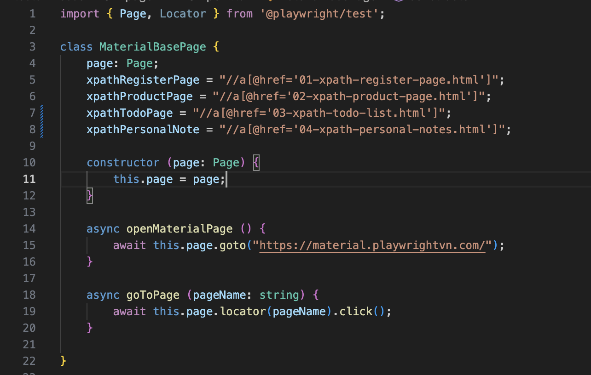
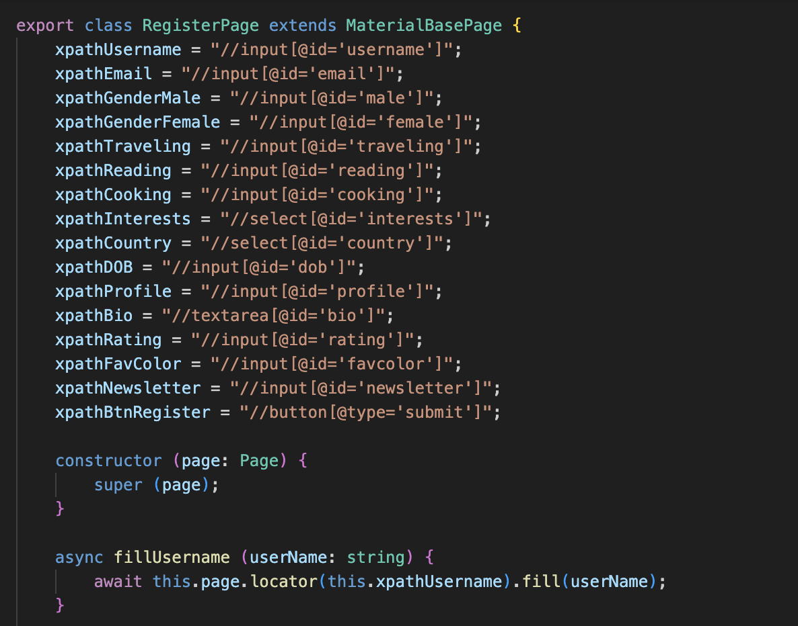
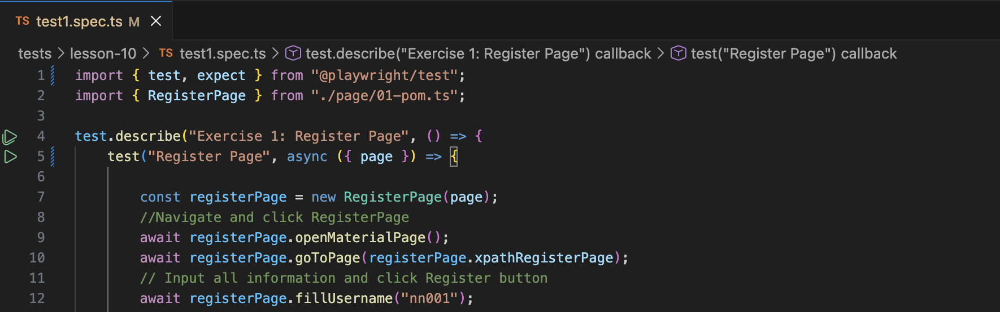

**1. Typescript và javascript:**
- TypeScript là superset của JavaScript (nghĩa là mở rộng của JavaScript).
- JavaScript “dễ dãi” quá => nhiều lỗi
- TypeScript ra đời để “khó tính” hơn => giảm bớt lỗi lại
- Code TypeScript cần được biên dịch qua JavaScript trước khi chạy
        npm install -d typescript
        npx tsc <file_path>
- Dùng TypeScript vì có nhiều ưu điểm so với JavaScript
        - Có hệ thống kiểu dữ liệu
        - Phát hiện lỗi sớm
        - Interface & type alias
        - OOP features
        - Generic
- Dùng lệnh **npx tsc <file_path>** để biên dịch file ts thành file js
Sau đó chạy bằng lệnh **node <file_path>**
- Trong TypeScript, có thể định nghĩa “kiểu dữ liệu” thông qua **type** hoặc **interface** 
Type:
type <type_name> = {
    prop1: dataType1;
    prop2: dataType2;
    ...
}
Interface: interface không có dấu =
VD:
```python
type User = {
    name: string;
    age: number;
}

interface User {
    name: string;
    age: number;
}

const user1: User = {
    name: "Nga",
    age: 18,
}
```

**2. Typescript: Class và Extends**
**Class**: Dùng để mô hình hoá một đối tượng: có các thuộc tính (property) và hành vi (methods) mà đối tượng có thể có
**Extends**:là cơ chế kế thừa (inheritance) cho phép một class "thừa hưởng" các thuộc tính và phương thức từ class khác
- Hàm “super()” = gọi tới hàm tạo của class cha
- Kế thừa giúp bạn tái sử dụng các thuộc tính của phần tử cha.
- Hàm tạo (constructor) là hàm sẽ chạy khi bạn khởi tạo một object.
**Export**: Từ khoá export giúp chúng ta có thể xuất 1 biến, 1 hằng số ở 1 file và dùng (import) ở 1 file khác
VD:





**3. POM**
- POM = Page Object Model
- POM giúp code tổ chức gọn gàng hơn, dễ bảo trì hơn
- POM gồm 2 thành phần chính:
  - Các thuộc tính (property): đại diện cho các phần tử trên trang.
  - Các phương thức (method): đại diện cho các hành động trên trang.
- Hàm tạo của POM thường có thuộc tính page. Ta sẽ dùng page này để tương tác với trang web.
- Thuộc tính page này nếu đã xuất hiện trong POM cha rồi thì bạn không cần định nghĩa ở POM con nữa.