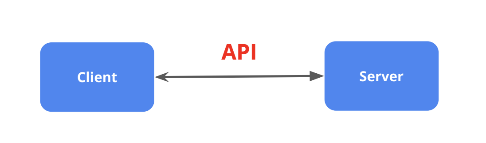

## 1. API = Application Programming Interface
API: Bộ quy tắc giúp phần mềm giao tiếp với nhau (gửi request → nhận response).


Ví dụ thực tế: 
- Ứng dụng thời tiết trên điện thoại dùng API để lấy dữ liệu thời tiết từ server
- Website thanh toán dùng API của ngân hàng để xử lý giao dịch
- Ứng dụng đặt xe dùng API Google Maps để hiển thị bản đồ
API giống như "cầu nối" hoặc "hợp đồng" giúp các hệ thống khác nhau làm việc cùng nhau mà không cần biết chi tiết bên trong của nhau.


**Tại sao cần test API?**
- Đảm bảo hoạt động đúng: API trả về dữ liệu chính xác, xử lý logic đúng như thiết kế
- Phát hiện lỗi sớm: Bắt bug trước khi ảnh hưởng đến frontend hoặc người dùng cuối
- Kiểm tra bảo mật: Đảm bảo API không bị truy cập trái phép, không lộ dữ liệu nhạy cảm
- Kiểm tra hiệu năng: API phản hồi đủ nhanh, chịu tải được nhiều request cùng lúc
- Tránh phụ thuộc: Frontend/Mobile có thể test độc lập, không cần đợi giao diện hoàn thành
- Dễ bảo trì: Khi sửa code, chạy lại test để chắc chắn không làm hỏng
tính năng cũ

**Các thành phần của API**
- URL
- Method: GET, POST, PUT/PATCH, DELETE
- Request: Header, Parameter, Body
- Response: Status Code, header, body
    - 1xx: Phản hồi thông tin
    - 2xx: Phản hồi thành công
    - 3xx: Điều hướng
    - 4xx: Lỗi phía client
    - 5xx:  Lỗi phía server

## 2. API với Postman

- Công cụ manual test API phổ biến.
- Tạo request (GET/POST/...), thêm headers (Authorization), body (JSON/form-data).
- Test collection, environment variables, assertions.
- Ưu điểm: Dễ dùng, visualize response.
- Nhược điểm: Không tự động hóa tốt như code, khó tích hợp CI/CD.

## 3. API Testing với Playwright (Ưu điểm chính)

- Tích hợp sẵn fixture request (APIRequestContext) → không cần thư viện ngoài.
- Hỗ trợ đầy đủ: GET/POST/PUT/DELETE, headers, data, auth.

## 4. Các khái niệm & Code cơ bản

Sử dụng fixture { request }:
```TypeScript
test('API login', async ({ request }) => {
  const res = await request.post('/login', { data: { email, password } });
  expect(res.status()).toBe(200);
  const json = await res.json();
  console.log(json);
});
```
- Headers auth: 
```{ headers: { Authorization: Bearer ${token} } }```
- Parse response: 
```await response.json(), response.status(), response.ok()```

## 5. Lỗi thường gặp & Fix

- Request context disposed: Không await hết → Fix: await mọi promise, tránh async trong forEach.
- No token provided: Quên truyền header Authorization → Lưu token sau login, truyền vào POM.
- console.log(response) không hiện JSON: Phải await response.json() trước khi log.


## 6. Flow test điển hình

- beforeEach: Login admin → lấy token.
- Test case: Create user → assert status 201 + success.
- Lấy userId từ response.
- getUsers → check user tồn tại.
- afterEach: Delete user để cleanup.

## 7. Best Practices

- Luôn await hết async.
- Expect status code + success flag + data.
- Log full response khi debug.
- Cleanup data sau test.


