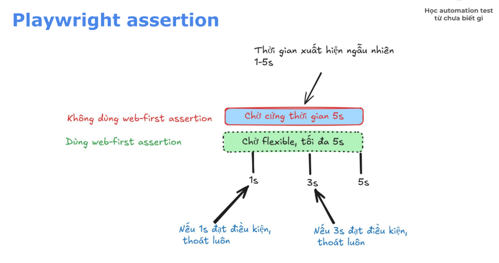

*** 1. Test group/ suite: tập hợp test cases.***
- Test suite giúp: nhóm các test lại cho dễ quản lý
- Test suite trong Playwright: 
test.describe('<tên suite>', async () => {
    test('test1', async ({ page }) => {
        // code ...
    });

    test('test 2', async ({ page }) => {
        // code ...
    });
})

*** 2. Hooks: ***
- Các thời điểm chạy test:
    ○ Trước khi chạy
    ○ Trong khi chạy
    ○ Sau khi chạy
- Các thời điểm chạy suite
    ○ Trước khi chạy
    ○ Trong khi chạy
    ○ Sau khi chạy
- Playwright gọi các thời điểm này là hooks.
Playwright hooks: beforeAll, beforeEach, afterEach, afterAll


*** 3. Assertion & Web first assertion ***

Assertion trong lập trình nghĩa là "khẳng định" hoặc "xác nhận".

Assertion là một câu lệnh để kiểm tra xem một điều gì đó có đúng như mong đợi hay không.

Tại sao cần Assertion? Không có assertion = không biết test có thành công hay thất bại

Playwright assert thông qua hàm expect
```python
import { test, expect } from '@playwright/test';

test("Test 01", async ({ page }) => {
    // Khẳng định rằng: title trang phải là "Homepage"
    await expect(page).toHaveTitle('Homepage');

    // Khẳng định rằng: button phải visible (nhìn thấy được)
    await expect(page.locator('button')).toBeVisible();

    // Khẳng định rằng: giá trị phải bằng 5
    expect(2 + 3).toBe(5);
})
```
|Không có Assertion         | Có Assertion      | 
|---------------------      |-------------------|
| Chỉ thực hiện hành động   | Kiểm tra kết quả có đúng không        |
| await page.click('button')  | await expect(page.locator('button')).toBeVisible() | 
| "Tôi click nút"             | "Tôi kiểm tra xem nút có hiển thị không"       | 

***Các loại assertion:***

● Generic Assertions (từ thư viện expect)

    ○ expect(giá trị) = (giá trị)

VD:

    ● expect(value).toBe(expected);

    ● expect(array).toHaveLength(3);

    ● expect(string).toContain('text');

● Web-first Assertions (auto-waiting): Dùng cho các elements trên web, tự động chờ đến khi điều kiện
được thỏa mãn

    ○ expect(phần tử) có giá trị

VD:

    ● await expect(page.locator('button')).toBeVisible();

    ● await expect(page).toHaveTitle(/Homepage/);    


***Web-first assertion phổ biến***
**Element State**
```python
// Kiểm tra visibility
await expect(locator).toBeVisible();
await expect(locator).toBeHidden();
// Kiểm tra enabled/disabled
await expect(locator).toBeEnabled();
await expect(locator).toBeDisabled();
// Kiểm tra checked (checkbox/radio)
await expect(locator).toBeChecked();
// Kiểm tra focus
await expect(locator).toBeFocused();
```
**Text & Content**
```python
// Có chứa text
await expect(locator).toContainText('Hello');

// Text chính xác
await expect(locator).toHaveText('Welcome');

// Text khớp regex
await expect(locator).toHaveText(/welcome/i);

// Kiểm tra nhiều elements
await expect(locator).toHaveText(['Item 1', 'Item 2']);
```

**Attributes & Properties**
```python
// Kiểm tra attribute
await expect(locator).toHaveAttribute('href', '/about');

// Kiểm tra class
await expect(locator).toHaveClass('active');
await expect(locator).toHaveClass(/btn-primary/);

// Kiểm tra value (input fields)
await expect(locator).toHaveValue('john@example.com');
// Kiểm tra count
await expect(locator).toHaveCount(5);
```

**Page Assertions**
```python
// URL
await expect(page).toHaveURL('https://example.com/');
await expect(page).toHaveURL(/.*checkout/);

// Title
await expect(page).toHaveTitle('My App');
```

